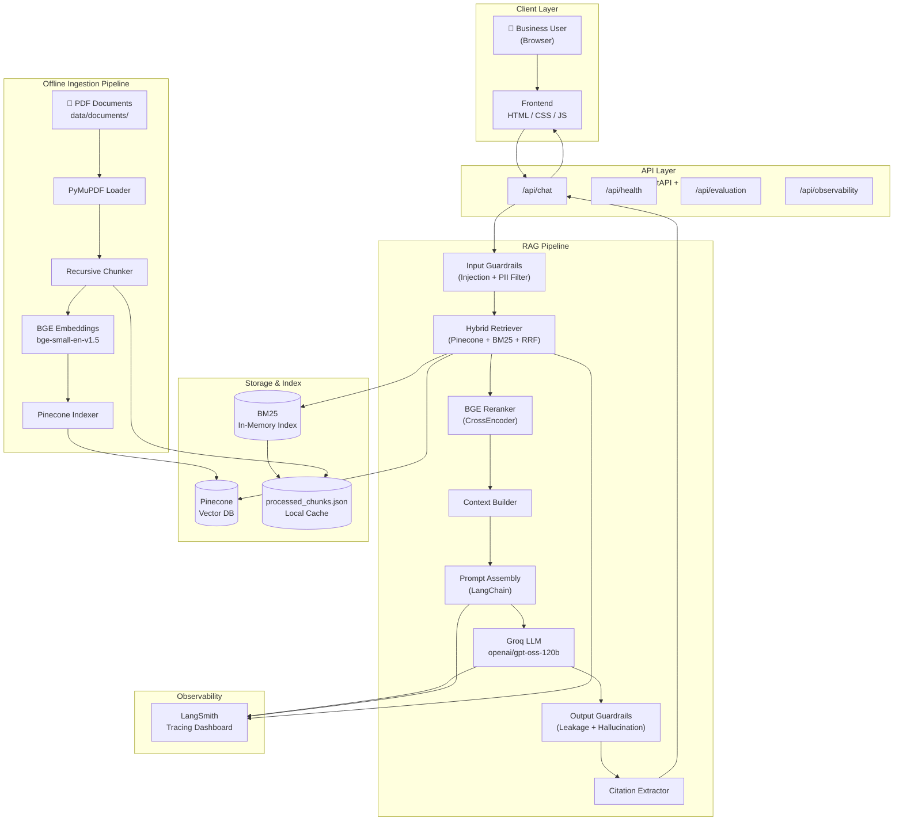
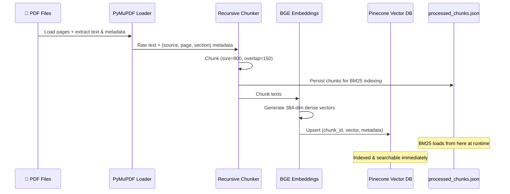
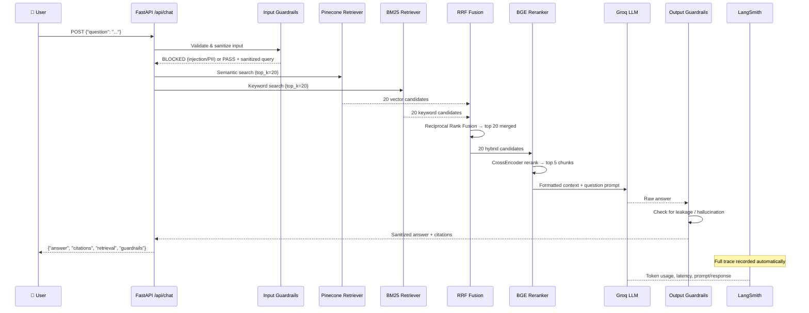
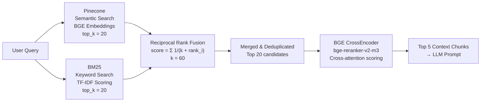
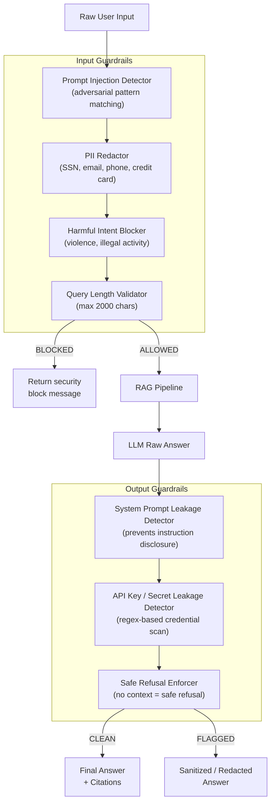
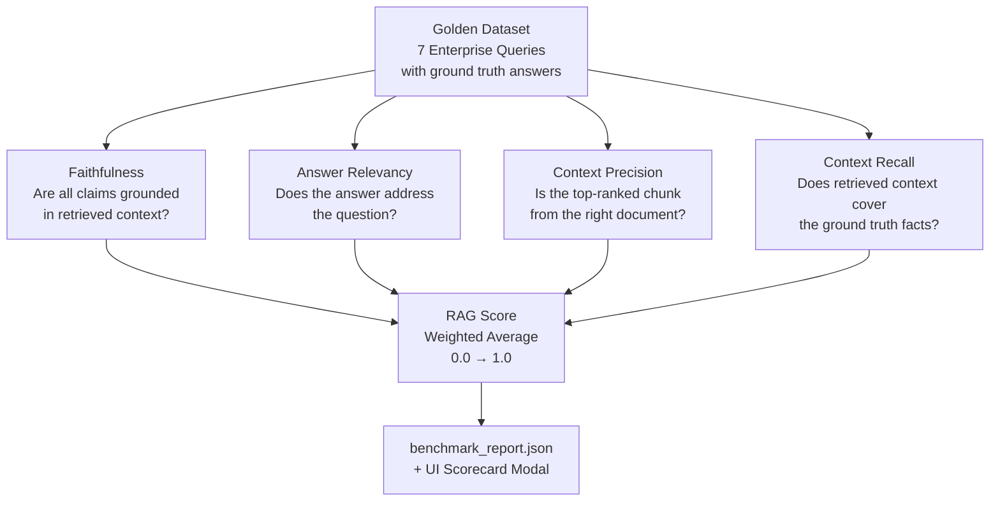
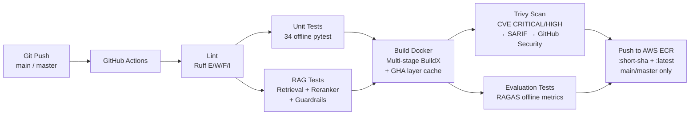
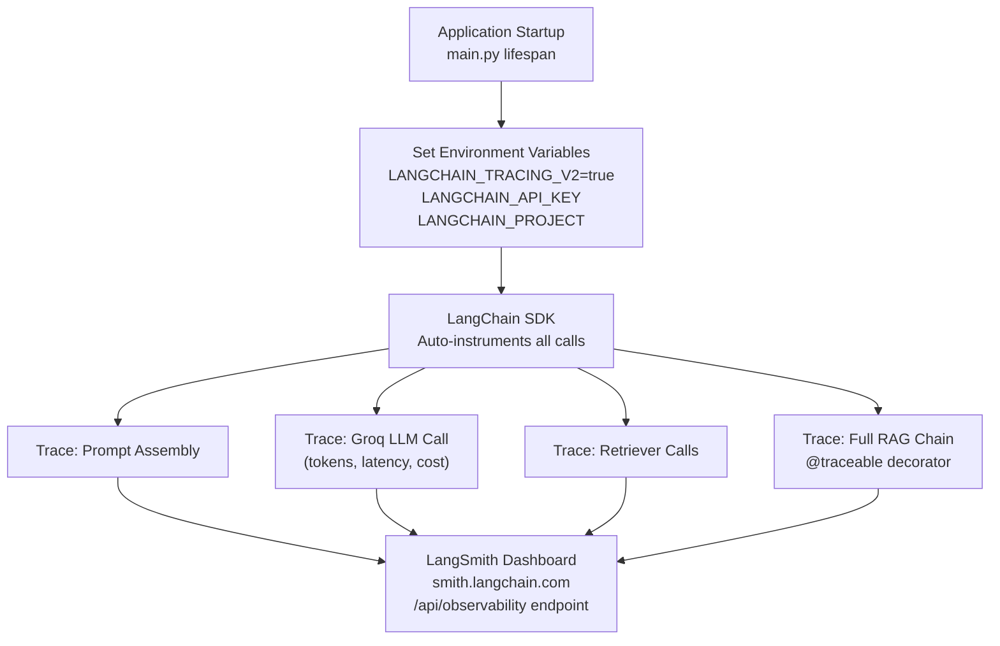

# System Design — Enterprise RAG Assistant
## Policy & Contract Intelligence

---

## 1. High-Level Architecture

---

## 2. Offline Ingestion Pipeline

---

## 3. Online Query Pipeline (Per Request)

---

## 4. Hybrid Retrieval & RRF Fusion

---

## 5. AI Guardrails Architecture

---

## 6. RAGAS Evaluation Framework

---

## 7. CI/CD Pipeline (GitHub Actions → AWS ECR)

---

## 8. LangSmith Observability Flow

---

## 9. Data Flow Summary

| Stage | Input | Process | Output |
|---|---|---|---|
| **Ingestion** | PDF files | PyMuPDF → Chunk → Embed | Pinecone index + BM25 cache |
| **Input Guard** | Raw query | Injection / PII detection | Sanitized query or block |
| **Retrieval** | Query | Pinecone + BM25 + RRF | 20 merged candidates |
| **Reranking** | 20 candidates | BGE CrossEncoder | Top 5 context chunks |
| **Generation** | Context + query | Groq LLM | Raw answer |
| **Output Guard** | Raw answer | Leakage / hallucination check | Clean final answer |
| **Citation** | Top 5 chunks | Metadata extraction | Document + page + section |
| **Evaluation** | 7 golden queries | RAGAS metrics | Score 0.0–1.0 |
| **Observability** | All LangChain calls | LangSmith tracing | Dashboard traces |

---

## 10. Technology Decisions

| Decision | Choice | Reason |
|---|---|---|
| Vector DB | Pinecone | Managed, scalable, low-latency ANN search |
| Keyword Search | BM25 | Handles exact terms, acronyms, IDs — complements semantic |
| Fusion | RRF | Parameter-free, robust rank merging — no score normalization needed |
| Reranker | BGE CrossEncoder | Token-level cross-attention far outperforms bi-encoder re-scoring |
| LLM | Groq / openai/gpt-oss-120b | Low-latency inference, deterministic (temp=0) for grounded answers |
| Embeddings | BGE-small-en-v1.5 | 384-dim, fast, strong English semantic accuracy |
| Observability | LangSmith | Native LangChain integration, zero-instrumentation auto-tracing |
| Evaluation | RAGAS | Industry-standard RAG metrics, fully offline capable |
| Container | Docker multi-stage | Lean runtime image, non-root user, secrets never baked into layers |
| CI/CD | GitHub Actions + ECR | Native GH integration, Trivy CVE scanning, immutable SHA tags |
